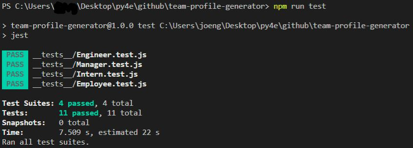
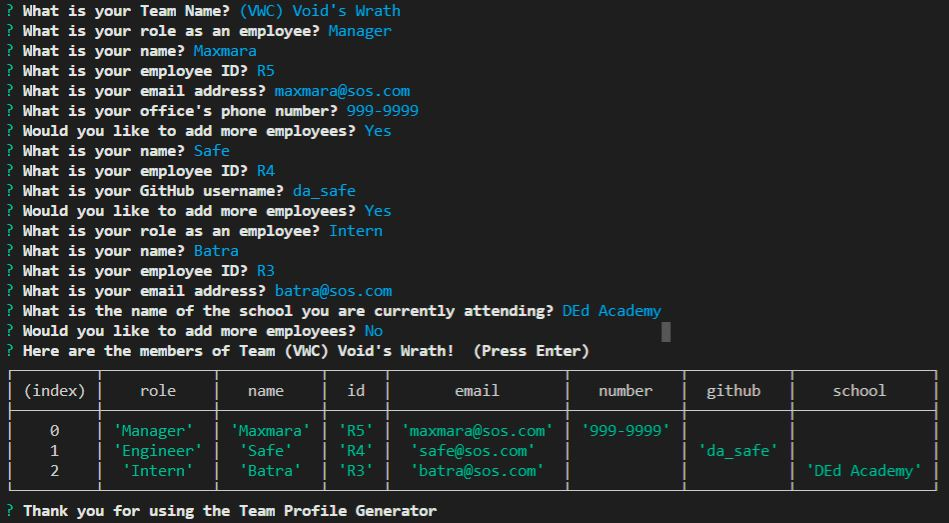
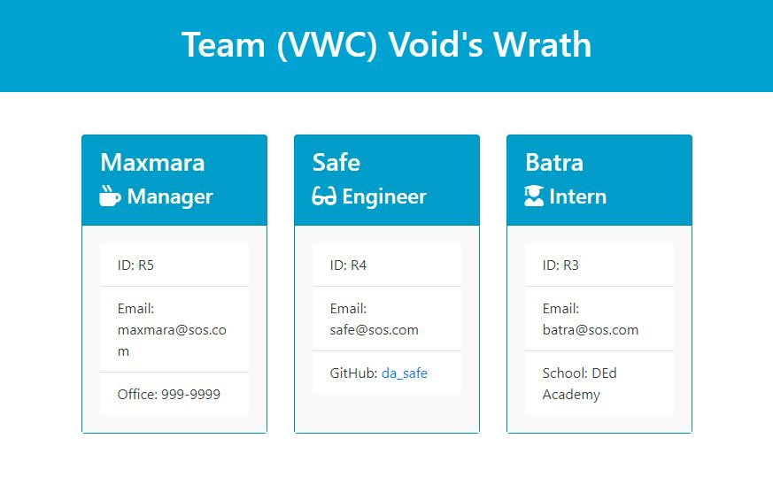

# Team Profile Generator
This Team Profile Generator is a Node.js command-line application

## Installation
In order to get to the generator questionnaire, you must first download the repository 'team-profile-generator' by clicking the GitHub link under the 'Link to Repository' section. 
Once the repository is cloned, use your terminal to initiate the command 'node index.js.'  A series of questions will be presented to you.  After completing the questionnaire,
a message showing the table of the team members will show up as a confirmation that the readme file has been created.  The generated HTML will be located in the distribution folder (dist) as an 'index.html' file.
Open your team's profile is generated, right-click 'index.html' and choose 'Open in Default Browser" and voila!

## Created using
* Javascript
* Node.js
* ES6
* npm inquirer
* HTML
* Bootstrap 4
* https://fontawesome.com/

## Link to Repository
https://github.com/itsrheine/team-profile-generator

## Link to Video
https://drive.google.com/file/d/1MFfHy671CR4ImKYmxIKTzWhEB1mlwdvP/view

## Screencastify

## Screenshot

